# AuthEase Light And Dark Theme 🔐


[](#)

Securely access your world with ease, powered by our Authentication app with auto-themeing technology. Say goodbye to the hassle of manually switching themes and trust in the reliable Riverpod and Flutter framework at the core of our app 

# 📲 Download

<br>
<a href="https://play.google.com/store/apps/details?id=com.ichie.todey">
    </img>
</a>

# Flutter Version
Flutter 3.7.0


# 💻 Requirements

- Any Operating System (ie. MacOS X, Linux, Windows)
- Any IDE with Flutter SDK installed (ie. IntelliJ, Android Studio, VSCode etc)
- A little knowledge of Dart and Flutter

# Screenshots

 | 1 | 2|
|------|-------|
|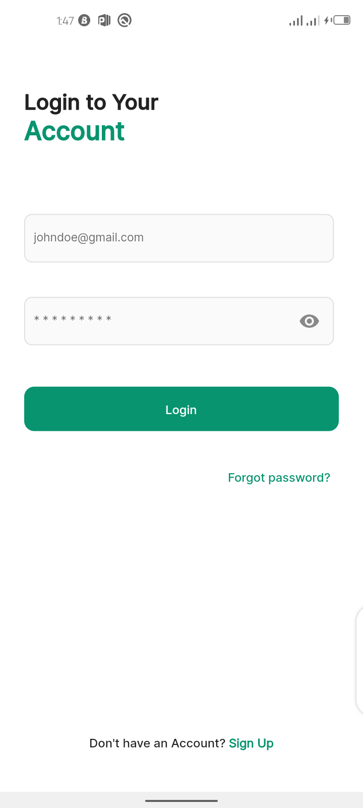||


 | 3 | 4|
|------|-------|
|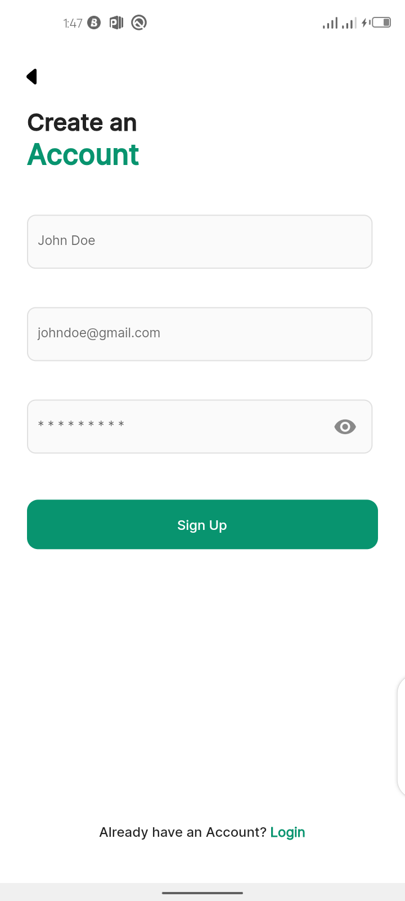|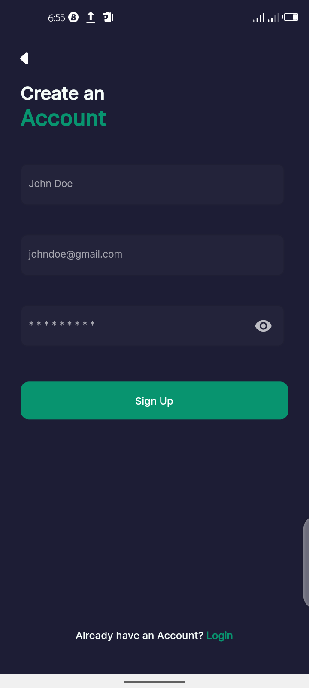|


 | 5 | 6|
|------|-------|
|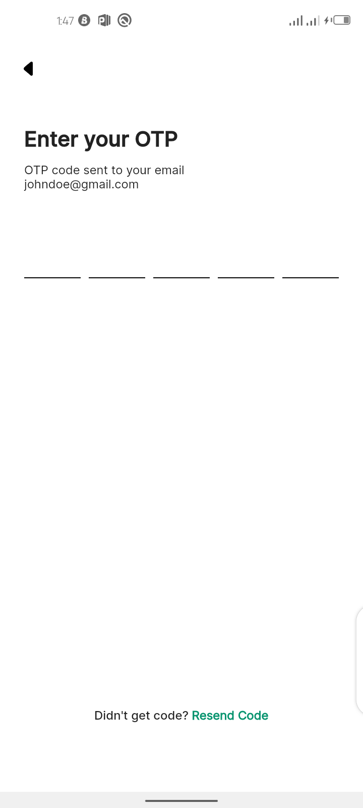|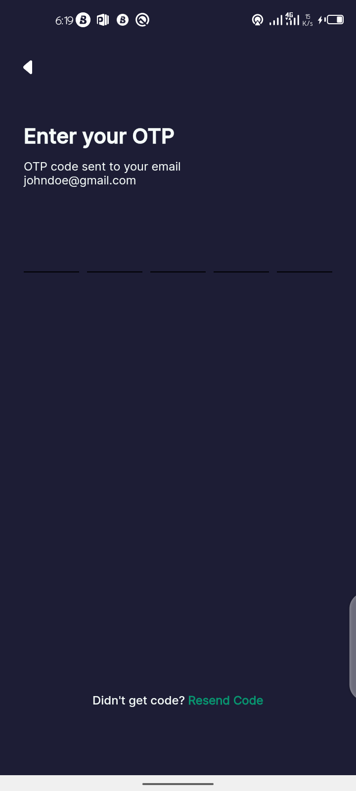|


 | 7 | 8|
|------|-------|
|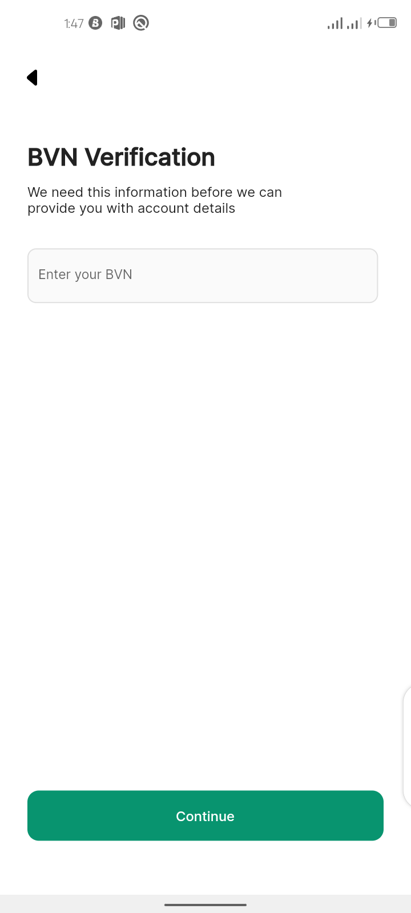|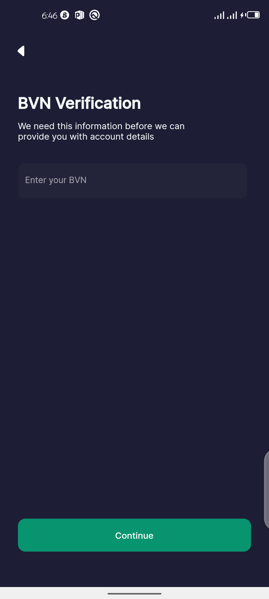|

 | 9 | 10|
|------|-------|
|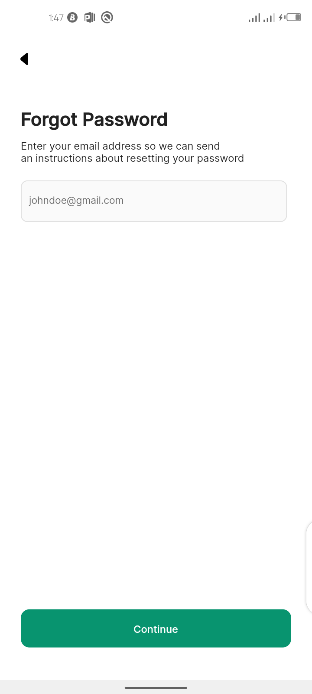|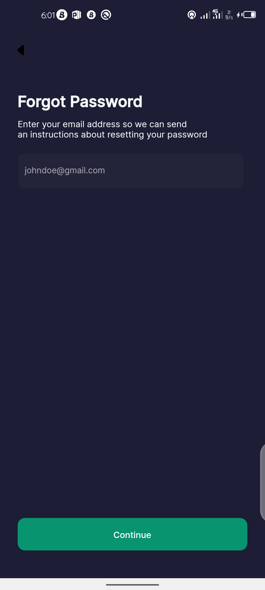|


 | 11 | 12|
|------|-------|
|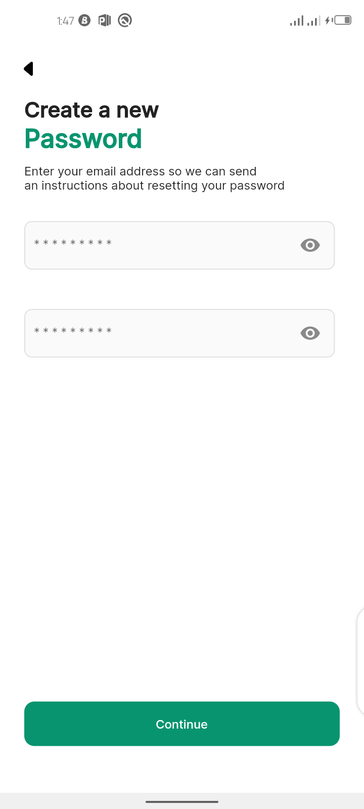|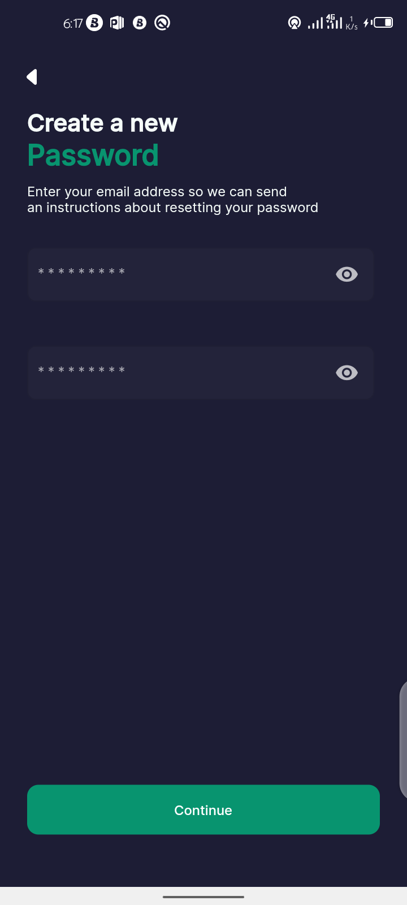|

 | 13 | 14|
|------|-------|
|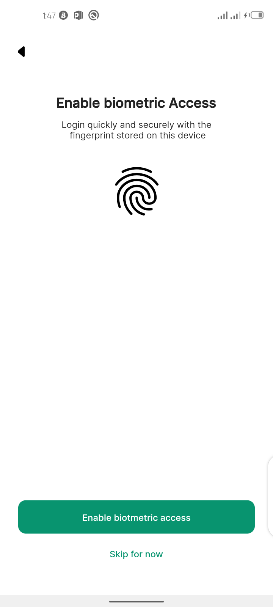|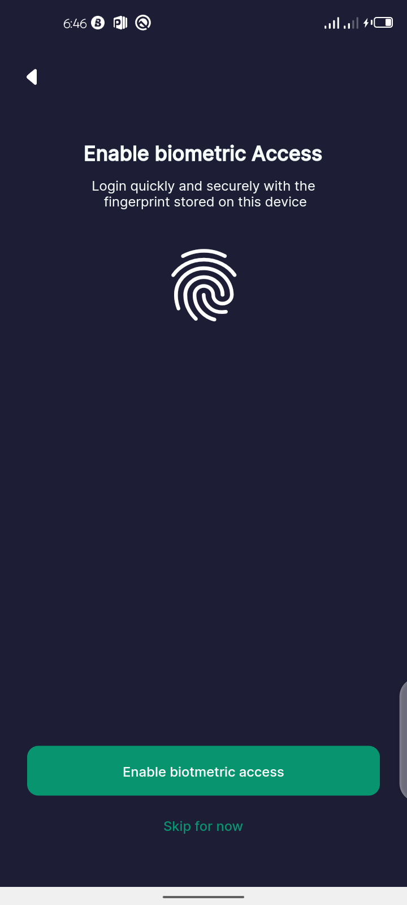|


# Command
### Install dependencies

```sh
flutter pub get
```

### Run application

```sh
flutter emulators --launch <emulator_name>
flutter run
```

### Build

```sh
flutter build apk
```

# Plugins

- [firebase_core](https://pub.dev/packages/firebase_core) 
- [firebase_auth](https://pub.dev/packages/firebase_auth) 
- [flutter_riverpod](https://pub.dev/packages/flutter_riverpod) 
- [google_fonts](https://pub.dev/packages/google_fonts) 
- [flutter_screenutil](https://pub.dev/packages/flutter_screenutil) 
- [pinput](https://pub.dev/packages/pinput) 
- [country_picker](https://pub.dev/packages/country_picker) 
- [hooks_riverpod](https://pub.dev/packages/hooks_riverpod) 
- [local_auth](https://pub.dev/packages/local_auth)
- [flutter_svg](https://pub.dev/packages/flutter_svg) 
- [cached_network_image](https://pub.dev/packages/cached_network_image) 
- [hive](https://pub.dev/packages/hive)
- [hive_flutter](https://pub.dev/packages/hive_flutter)
- [flutter_hooks](https://pub.dev/packages/flutter_hooks)


# Features
- Light/Dark Theme
- Local Auth (Fingerprint)


## Author

👤 **Dammy Richie**

* [Adekunle Damilola Sunday](https://github.com/kin-devv)
 

